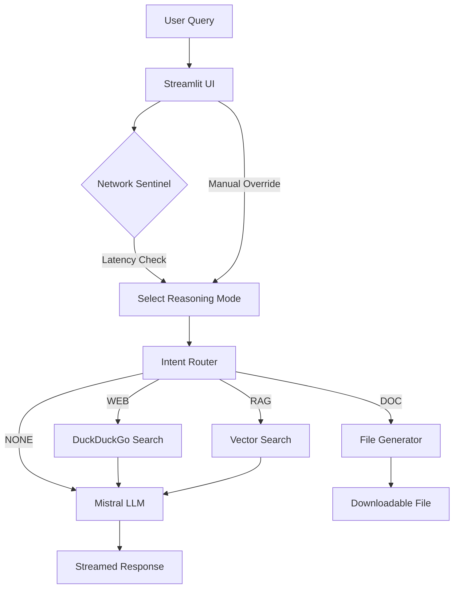

# 🧠 Adaptive Reasoning Agent Pro

**A latency-aware AI agent that adjusts *how* it thinks based on *where* it operates.**

   

## 📖 Overview

The **Adaptive Reasoning Agent** is a "framework-less" AI system designed to solve the problem of AI performance under varying network conditions. Unlike static chatbots, this agent utilizes a **Network Sentinel** to monitor real-time latency and dynamically switches its cognitive strategy:

* **⚡ Fast Response:** (Low Latency / Manual Override) -> Heuristic, TL;DR answers.
* **⚖️ Standard:** (Moderate Latency) -> Balanced, structured explanations.
* **🧠 Deep Reasoning:** (High Latency / Manual Override) -> Analytical, multi-step logic.

It features a **Native RAG Pipeline** built from scratch (no LangChain/VectorDB dependencies) and a powerful **Document Generation Engine** capable of creating PDFs, Word Docs, and Excel sheets on command.

---

## ✨ Key Features

### 1. 📡 Network-Adaptive Intelligence
The core engine (`NetworkSentinel`) pings high-availability servers to calculate RTT (Round Trip Time).
* **< 300ms:** Enables *Deep Reasoning* (Heavy compute allowed).
* **< 1000ms:** Enforces *Standard Mode*.
* **> 1000ms:** Triggers *Fast Response* (Panic mode, minimizes tokens).
* *Note: Users can manually override this strategy via the Sidebar.*

### 2. 📂 Native RAG Pipeline
A custom-built Retrieval Augmented Generation system without external libraries like LangChain or ChromaDB.
* **Ingestion:** Parses PDF documents using `pypdf`.
* **Chunking:** Sliding window text chunking.
* **Vectorization:** Uses `mistral-embed` for high-quality embeddings.
* **Retrieval:** `scikit-learn` Cosine Similarity for precise context matching.

### 3. 🛠️ Multi-Modal Tooling
The agent intelligently routes queries to specific tools based on intent classification:
* **📄 Document Generator:**
    * **PDF:** Generates structured reports with sanitization for special characters.
    * **Word (.docx):** Creates editable documents with real headings and formatting.
    * **Excel (.xlsx):** Parses data requests into structured spreadsheets.
* **🌐 Adaptive Web Search:** Uses DuckDuckGo to perform "Shallow" (3 results) or "Deep" (8 results + news) searches based on the current reasoning mode.

### 4. 🎨 Clean Streamlit UI
* Dark Mode optimized.
* Real-time token streaming.
* Dynamic "Download" buttons that appear only when files are generated.
* Visual "Internal Thinking" expanders to show the agent's logic.

---

## 🏗️ Architecture



## 🚀 Installation & Setup

### Prerequisites
* Python 3.8+
* A Mistral AI API Key

### 1. Clone the Repository
```bash
git clone https://github.com/nabeelshan78/devcon_module3.git
cd devcon_module3
```

2. Create a Virtual Environment
```
python -m venv venv
```
# Windows
```.\venv\Scripts\activate```

3. Install Dependencies
```
pip install -r requirements.txt
```
4. Configure Environment
Update config.py directly for API
```
MISTRAL_API_KEY=your_mistral_api_key_here
```

5. Run the Application
```
streamlit run app.py
```

# 📂 Project Structure
```
adaptive-reasoning-agent/
├── app.py                     # Main Streamlit UI entry point
├── config.py                  # Configuration & Thresholds
├── requirements.txt           # Dependencies
├── data/                      # Temporary storage for generated files
└── src/
    ├── core/
    │   └── reasoning_engine.py # The brain: Router, Prompt Engineering, Agent Logic
    ├── tools/
    │   ├── document_tool.py    # Generates PDF/DOCX/XLSX
    │   ├── native_rag.py       # Custom RAG implementation
    │   └── web_tool.py         # Adaptive Web Search
    └── utils/
        └── network.py          # Latency detection logic
```

# Usage Examples
Generating Documents
User: "Create an Excel sheet comparing the revenue of Apple, Google, and Microsoft."

>> Agent: Detects DOC intent -> Parses data -> Creates .xlsx -> Provides [Download] button.

# Adaptive Search
- User: "What is the latest news on Quantum Computing?"
- Agent (Deep Mode): Performs a deep web search (8+ sources), synthesizes a detailed report.
- Agent (Fast Mode): Grabs top 3 headlines, provides a 2-sentence summary.

## RAG Analysis
- Action: Upload a PDF via the Sidebar.
- User: "Summarize the key findings of this paper."
- Agent: Vectorizes the PDF -> Retrieves top-k chunks -> Generates grounded summary.


>>Built for the DevCon Module 3 Challenge.
